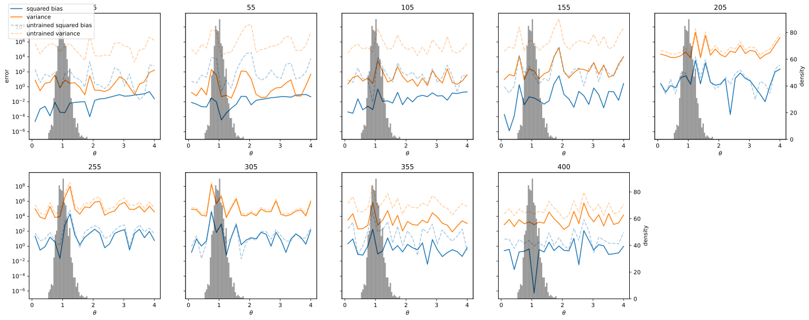
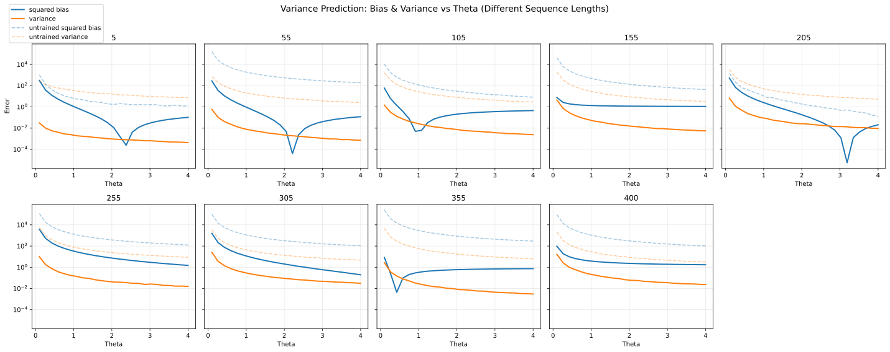
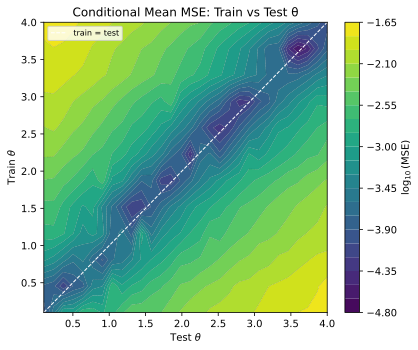

## Evaluation

The theta sweep measures whether the trained model correctly predicts the **conditional moments** of the next-step OU distribution across two variables:

- **$\theta$** — the mean-reversion speed
- **$L$** — the sequence length (context available to the model)

`scripts/test.py` generates fresh trajectories for each $(\theta, L)$ pair, runs both a trained and an untrained model, and records prediction quality metrics.

```bash
python scripts/test.py --coef 0  # conditional mean
python scripts/test.py --coef 1  # conditional variance
```

The sweep covers $25 \times 9 = 225$ conditions (25 $\theta$ values × 9 sequence lengths from 5 to 400 in steps of 50), each evaluated on 5,000 independent replicates.

For each $(\theta, L)$ cell, the evaluation computes a **bias–variance decomposition** of the relative prediction error:

$$
\varepsilon_i = \frac{\hat{y}_i - y_i}{y_i}
$$

| Metric | Formula |
|--------|---------|
| Squared bias | $\left(\mathbb{E}[\varepsilon]\right)^2$ |
| Variance | $\text{Var}[\varepsilon]$ |
| Total relative error | Squared bias + Variance |

Every condition is compared against an untrained (randomly initialized) baseline to isolate the effect of learning.

---

## Experiment 1: Single θ, Constant Sequence Length

The model was trained on trajectories from a **single fixed $\theta$** with a constant sequence length of 100.

```bash
python scripts/data_gen.py
python scripts/train.py
```

### Conditional Mean


### Conditional Variance


---

## Experiment 2: Variable θ, Constant Sequence Length

The model was trained on trajectories sampled from a **distribution of $\theta$ values** with a constant sequence length of 100.

```bash
python scripts/data_gen.py
python scripts/train.py
```

### Conditional Mean



### Conditional Variance



---

## Experiment 3: Train θ vs Test θ Contour

For each value of training $\theta$, a fresh model is trained on single-$\theta$ data, then evaluated across a range of test $\theta$ values. The result is a 2D grid of MSE values showing how well a model trained at one $\theta$ generalizes to others.

| Parameter | Value |
|-----------|-------|
| Train $\theta$ grid | 12 values, linearly spaced in $[0.1, 4.0]$ |
| Test $\theta$ grid | 30 values, linearly spaced in $[0.1, 4.0]$ |
| Sequence length | 100 |
| Training trajectories | 1000 |
| Test trajectories | 2000 |
| Train/val split | 80/20 |
| Epochs | 150 |
| Batch size | 64 |
| Learning rate | $10^{-3}$ |
| Optimizer | Adam |
| Loss | MSE on conditional mean (coef 0) at last timestep |
| Marginal variance | 0.2 (fixed across all trajectories) |
| $\mu$ | 0.0 |
| $\Delta t$ | 0.1 |


